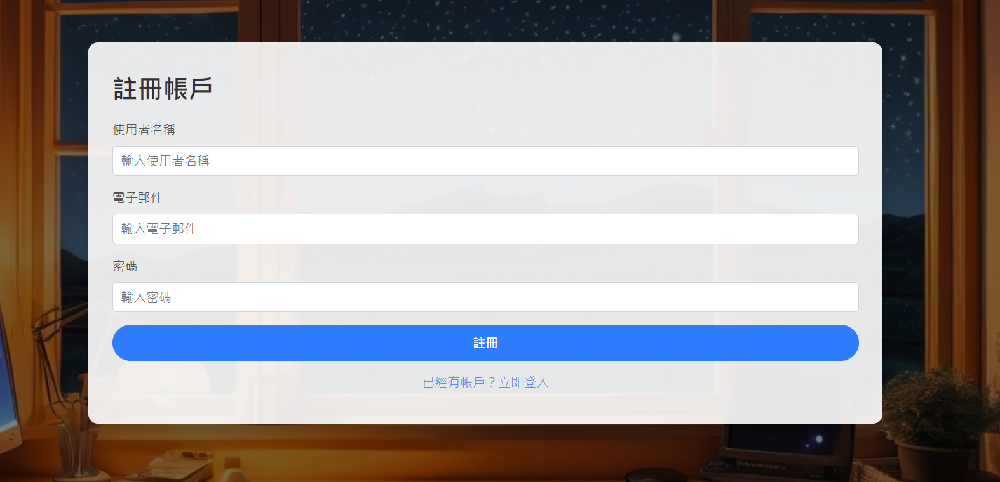
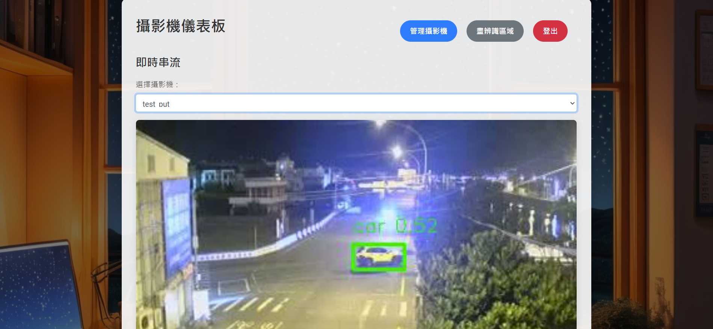
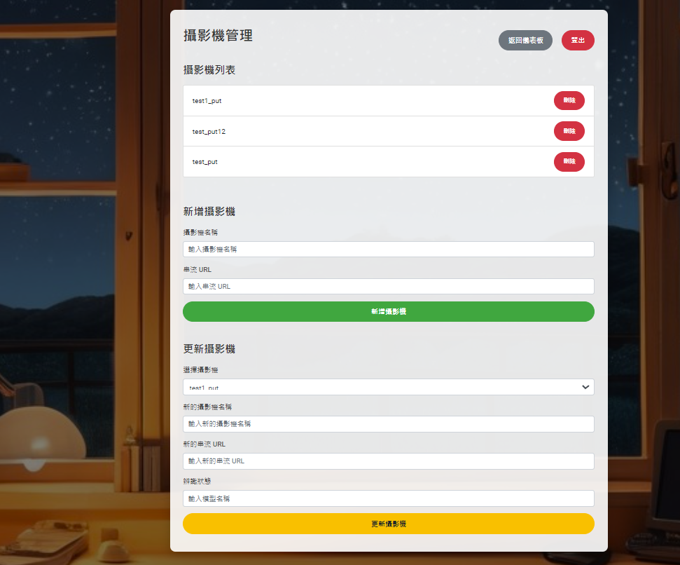
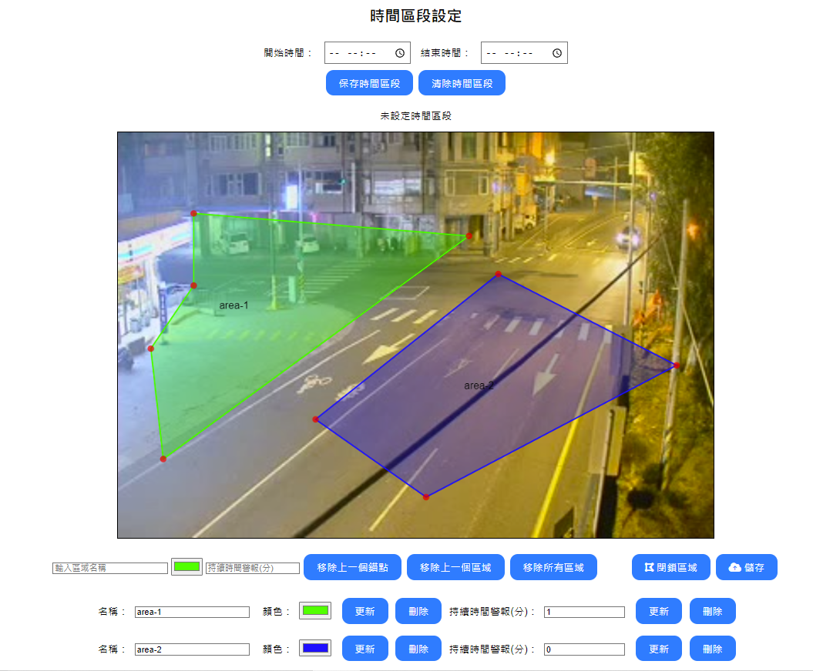

<div align="center">

# 🎯 VisionFlow

**Intelligent Image Recognition & Monitoring System**

[](https://www.docker.com/)
[](https://www.python.org/)
[](https://flask.palletsprojects.com/)
[](https://www.postgresql.org/)
[](https://redis.io/)
[](LICENSE)

[🇹🇼 中文](./README.md) | [🇺🇸 English](./README_en.md)

</div>

---

## 📋 Project Overview

**VisionFlow** is a powerful intelligent image recognition and monitoring system designed for modern visual surveillance needs. The system adopts a microservices architecture, integrating cutting-edge AI technology with cloud deployment solutions.

### 🌟 Core Features

- 🚀 **Real-time Image Recognition** - High-efficiency object detection using YOLO models
- 🎥 **Multi-camera Support** - Simultaneous management of multiple camera streams
- 🔒 **User Access Management** - Complete authentication and authorization system
- 🎨 **Custom Detection Areas** - Support for polygonal ROI drawing
- 📱 **Responsive Interface** - Modern web management interface
- 🐳 **Containerized Deployment** - Full Docker support
- ⚡ **High-performance Architecture** - Redis caching and load balancing

### 🛠️ Technology Stack

- **Backend Framework**: Flask + RESTful API
- **Database**: PostgreSQL (Primary) + Redis (Cache)
- **AI Model**: YOLO v11 Object Detection
- **Containerization**: Docker + Docker Compose
- **Frontend**: Modern JavaScript + Bootstrap
- **Communication**: WebSocket Real-time Streaming

---

## 🖥️ Feature Interface Showcase

<details>
<summary><b>🔐 User Login Interface</b></summary>
<br>

**Secure access portal with advanced authentication**

✅ **Security Features:**
- 🛡️ **Multi-layer Authentication**: Secure credential verification
- 🔒 **Session Management**: Advanced token-based security
- 🚪 **Access Control**: Role-based permission system
- 📱 **Responsive Design**: Optimized for all devices


</details>

<details>
<summary><b>🔑 User Registration Interface</b></summary>
<br>

**Comprehensive account creation with role management**

✅ **Registration Features:**
- 🛡️ **Secure Registration**: Advanced encryption for user credentials
- 👥 **Role Assignment**: Flexible user rights and permission system
- 📧 **Email Verification**: Automated account verification process
- 🔐 **Password Security**: Strong password requirements and validation
- ✨ **User-friendly Form**: Intuitive registration experience



</details>

<details>
<summary><b>📹 Real-time Recognition Stream</b></summary>
<br>

**Live video processing with AI-powered object detection**

🚀 **Advanced Capabilities:**
- 🎯 **Multi-Camera Support**: Monitor multiple video streams simultaneously
- 🤖 **AI Detection**: Real-time object recognition and classification
- 🏷️ **Smart Labeling**: Automatic object tagging with confidence scores
- ⚡ **Low Latency**: Optimized streaming for minimal delay
- 📊 **Live Statistics**: Real-time performance metrics and analytics
- 🎨 **Visual Overlays**: Dynamic bounding boxes and detection markers



</details>

<details>
<summary><b>🎛️ Camera Management System</b></summary>
<br>

**Comprehensive camera configuration and monitoring tools**

🔧 **Management Features:**
- ➕ **Add Cameras**: Easy integration of new camera sources
- ✏️ **Modify Settings**: Dynamic parameter adjustment
- 🗑️ **Remove Cameras**: Clean removal with data backup
- 🤖 **Model Assignment**: Bind specific AI models to each camera
- 📍 **Location Mapping**: Geographic camera positioning
- 🔗 **URL Configuration**: Support for RTSP, HTTP, and local cameras
- 📊 **Status Monitoring**: Real-time camera health check



</details>

<details>
<summary><b>🎨 Detection Area Drawing Tool</b></summary>
<br>

**Interactive ROI (Region of Interest) configuration**

🖱️ **Drawing Features:**
- 🔶 **Polygon Tool**: Create complex detection zones with precision
- ⏰ **Alert Duration**: Custom timing settings for each region
- 🔔 **Notification Settings**: Individual alert configurations
- 📐 **Precision Drawing**: Pixel-perfect area selection
- 🎯 **Multi-Region Support**: Multiple zones per camera
- 💾 **Save Configurations**: Persistent region settings
- 🎨 **Visual Feedback**: Real-time drawing preview



</details>

---

## 🚀 Quick Start

> **Get VisionFlow up and running in minutes with our streamlined deployment process**

### 📋 Prerequisites

Before starting, ensure you have the following tools installed:

| Tool | Version | Purpose | Download Link |
|------|---------|---------|---------------|
| 🐳 **Docker** | 20.10+ | Container Runtime | [Download](https://www.docker.com/) |
| 🔧 **Docker Compose** | 2.0+ | Multi-container Management | [Download](https://docs.docker.com/compose/) |

### ⚡ One-Click Deployment

<details>
<summary><b>🐳 Docker Deployment (Recommended)</b></summary>
<br>

**Step 1:** Clone the repository
```bash
# Clone VisionFlow repository
git clone https://github.com/yourusername/VisionFlow.git
cd VisionFlow
```

**Step 2:** Launch the complete system
```bash
# Start all services with Redis support
docker-compose -f docker-compose.yaml -f docker-compose-redis.yaml up -d
```

**Step 3:** Database initialization
```bash
# Initialize database schema (first time only)
docker-compose exec backend flask db upgrade
```

**Step 4:** Verify deployment
```bash
# Check service status
docker-compose ps

# View application logs
docker-compose logs -f backend
```

</details>

### 🔧 Configuration Steps

| Step | Command | Description |
|------|---------|-------------|
| **1️⃣ Clone** | `git clone [repo-url]` | Download VisionFlow source code |
| **2️⃣ Deploy** | `docker-compose up -d` | Launch all microservices |
| **3️⃣ Migrate** | `flask db upgrade` | Initialize database schema |
| **4️⃣ Configure** | Update `objectrecognition` | Add your AI model (`best.pt`) |
| **5️⃣ Verify** | Visit `localhost:5000` | Access web interface |

### ✅ Deployment Verification

After deployment, verify the system is working correctly:

- **🌐 Web Interface**: Open [http://localhost:5000](http://localhost:5000)
- **📊 API Health**: Check [http://localhost:5000/api/health](http://localhost:5000/api/health)
- **🗄️ Database**: Verify PostgreSQL connection
- **⚡ Redis Cache**: Confirm Redis is running
- **🎥 Camera Stream**: Test video feed functionality

---

## 📚 API Documentation

> **Comprehensive RESTful API for seamless integration**

<div align="center">

[](./API_Doc.md)
[](./postman_collection.json)

</div>

### 🔗 API Capabilities

| Category | Features | Endpoint |
|----------|----------|----------|
| 🎥 **Stream Processing** | Real-time video analysis | `/api/stream/*` |
| 🤖 **Model Management** | AI model switching & config | `/api/models/*` |
| 📹 **Camera Control** | CRUD operations for cameras | `/api/cameras/*` |
| 👤 **User Management** | Authentication & authorization | `/api/auth/*` |
| 📊 **Analytics** | Performance metrics & logs | `/api/analytics/*` |

**📖 [View Complete API Documentation →](./API_Doc.md)**

---

## 💻 Development & Testing

<details>
<summary><b>🏠 Local Development Environment</b></summary>
<br>

**Step 1:** Setup Python environment
```bash
# Create isolated virtual environment
python3 -m venv venv
source venv/bin/activate  # On Windows: venv\Scripts\activate

# Install all dependencies
pip install -r requirements.txt
```

**Step 2:** Environment configuration
```bash
# Copy environment template
cp .env.example .env

# Edit configuration
nano .env
```

**Step 3:** Start development server
```bash
# Run Flask in development mode
export FLASK_ENV=development
flask run --host=0.0.0.0 --port=5000
```

</details>

<details>
<summary><b>🧪 Testing & Quality Assurance</b></summary>
<br>

**Unit Testing:**
```bash
# Run all tests
pytest tests/ -v

# Run with coverage report
pytest tests/ --cov=app --cov-report=html
```

**API Testing:**
```bash
# Test API endpoints
pytest tests/test_api.py -v

# Load testing
locust -f tests/load_test.py --host=http://localhost:5000
```

**Code Quality:**
```bash
# Linting with flake8
flake8 app/ --max-line-length=88

# Format with black
black app/ tests/
```

</details>

### 🛠️ Development Tools

| Tool | Purpose | Command |
|------|---------|---------|
| **🧪 Pytest** | Unit Testing | `pytest tests/` |
| **📊 Coverage** | Test Coverage | `pytest --cov=app` |
| **🔍 Flake8** | Code Linting | `flake8 app/` |
| **⚫ Black** | Code Formatting | `black app/` |
| **🐛 Debugger** | Development Debug | `flask run --debug` |

---

## 📄 License

<div align="center">

[](LICENSE)

This project is licensed under the **MIT License** - see the [LICENSE](LICENSE) file for details.

**You are free to:**
- ✅ Use commercially
- ✅ Modify and distribute
- ✅ Private use
- ✅ Patent use

</div>

---

## 🤝 Contributions & Community

<div align="center">

[](https://github.com/yourusername/VisionFlow/graphs/contributors)
[](https://github.com/yourusername/VisionFlow/issues)
[](https://github.com/yourusername/VisionFlow/pulls)
[](https://github.com/yourusername/VisionFlow/stargazers)

</div>

### 💌 Get in Touch

<table align="center">
<tr>
<td align="center">

**📧 Email**<br>
[sky328423@gmail.com](mailto:sky328423@gmail.com)

</td>
<td align="center">

**🐛 Issues**<br>
[GitHub Issues](https://github.com/yourusername/VisionFlow/issues)

</td>
<td align="center">

**💡 Discussions**<br>
[GitHub Discussions](https://github.com/yourusername/VisionFlow/discussions)

</td>
</tr>
</table>

### 🎯 How to Contribute

We welcome contributions of all kinds! Here's how you can help:

<details>
<summary><b>🐛 Report Bugs</b></summary>

- Use the [issue tracker](https://github.com/yourusername/VisionFlow/issues)
- Include detailed reproduction steps
- Provide system information and logs

</details>

<details>
<summary><b>✨ Suggest Features</b></summary>

- Open a [feature request](https://github.com/yourusername/VisionFlow/issues/new)
- Describe the use case and benefits
- Provide mockups or examples if possible

</details>

<details>
<summary><b>🔧 Submit Code</b></summary>

1. Fork the repository
2. Create a feature branch (`git checkout -b feature/AmazingFeature`)
3. Commit your changes (`git commit -m 'Add some AmazingFeature'`)
4. Push to the branch (`git push origin feature/AmazingFeature`)
5. Open a Pull Request

</details>

---

<div align="center">

**⭐ If you find VisionFlow helpful, please consider giving it a star! ⭐**

[](https://github.com/yourusername/VisionFlow/stargazers)

*Made with ❤️ by the VisionFlow team*

</div>
